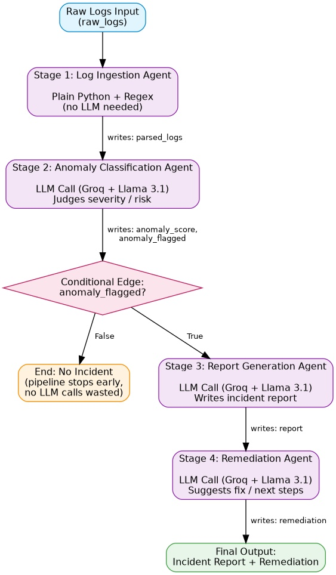

# NetTriage AI

Multi-agent log triage pipeline using LangGraph — automatically parses logs, classifies anomalies, and generates incident reports with remediation steps.

**Live API:** [https://nettriage-ai.onrender.com](https://nettriage-ai.onrender.com)

---

## What It Does

NetTriage AI automates the first-pass triage that SOC analysts and ops engineers do manually today. Raw network/system logs go in, and a structured incident report with actionable remediation steps comes out — powered by four specialized AI agents coordinated through LangGraph.

The system dynamically decides whether to generate a report based on intermediate results: if the logs look normal, the pipeline stops early after classification, saving unnecessary LLM calls. If an anomaly is detected, it proceeds to generate a full incident report and remediation plan.

---

## Architecture



**Stage 1 — Log Ingestion** (Python + Regex, no LLM)
Parses raw log text into structured entries: timestamp, severity, source, message. Uses regex instead of an LLM because this is a mechanical pattern-matching task — faster, cheaper, and more reliable.

**Stage 2 — Anomaly Classification** (Groq + Llama 3.1)
Analyzes structured logs and determines whether they represent a genuine anomaly. Outputs a confidence score (0.0–1.0), a boolean flag, and a short summary.

**Stage 3 — Report Generation** (Groq + Llama 3.1, conditional)
Only runs if Stage 2 flags an anomaly. Generates a human-readable incident report with timeline, severity assessment, and affected systems.

**Stage 4 — Remediation Suggestion** (Groq + Llama 3.1, conditional)
Only runs if Stage 2 flags an anomaly. Suggests concrete, actionable next steps based on the incident type.

---

## Tech Stack

| Layer | Technology |
|---|---|
| Language | Python |
| AI/LLM | Groq API, Llama 3.1 8B |
| Orchestration | LangGraph (StateGraph, conditional edges) |
| Web Framework | Flask |
| Production Server | Gunicorn |
| Containerization | Docker (multi-stage build, non-root user, health check) |
| CI/CD | GitHub Actions (lint + pipeline test) |
| Hosting | Render (free tier) |
| API Testing | Postman |

---

## Supported Attack Scenarios

The system handles multiple attack types with dynamically generated, scenario-specific responses:

- **Brute Force** — repeated failed login attempts from a single IP
- **Port Scanning** — rapid sequential connection attempts across multiple ports
- **Data Exfiltration** — unusual database queries, large exports, external connections
- **Privilege Escalation** — unauthorized role changes, sudo abuse, config file modification
- **DDoS** — connection floods from multiple IPs, backend exhaustion
- **Normal Traffic** — correctly classified as benign (no report generated, pipeline stops early)

---

## Quick Start

### Run Locally

```bash
git clone https://github.com/ASH2090/nettriage-ai.git
cd nettriage-ai
python -m venv venv
source venv/bin/activate        # Windows: venv\Scripts\activate
pip install -r requirements.txt
```

Create a `.env` file with your Groq API key:
```
GROQ_API_KEY=your_key_here
```

Run the pipeline directly:
```bash
python -m main
```

Start the API server:
```bash
python app.py
```

### Run with Docker

```bash
docker build -t nettriage-ai .
docker run -p 5000:5000 --env-file .env nettriage-ai
```

### Live Demo

Run the demo script to generate random attack scenarios and test against the live API:
```bash
python demo.py                        # Random scenario
python demo.py "Brute Force Attack"   # Specific scenario
python demo.py "Port Scanning"
python demo.py "DDoS Attack"
python demo.py "Data Exfiltration"
python demo.py "Privilege Escalation"
```

---

## API Reference

### Health Check

```
GET /
```
Response:
```json
{"status": "ok", "service": "NetTriage AI"}
```

### Triage Logs

```
POST /triage
Content-Type: application/json
```
Request body:
```json
{
  "logs": "2026-06-17 14:32:10 [ERROR] source=auth_service - Failed login attempt for user admin"
}
```

Response (anomaly detected):
```json
{
  "anomaly_flagged": true,
  "anomaly_score": 0.8,
  "anomaly_summary": "Repeated failed login attempts indicate a brute-force attack",
  "parsed_logs": [...],
  "report": "Incident report text...",
  "remediation": "1. Block IP... 2. Reset credentials...",
  "errors": []
}
```

Response (normal traffic):
```json
{
  "anomaly_flagged": false,
  "anomaly_score": 0.1,
  "anomaly_summary": "Normal web server activity",
  "parsed_logs": [...],
  "report": null,
  "remediation": null,
  "errors": []
}
```

---

## Postman

Import `postman_collection.json` into Postman to access 9 pre-built test requests covering all attack scenarios, normal traffic, and error handling edge cases.

---

## Project Structure

```
nettriage-ai/
├── agents/
│   ├── ingestion_agent.py        # Stage 1: Log parsing (regex)
│   ├── classification_agent.py   # Stage 2: Anomaly detection (LLM)
│   ├── report_agent.py           # Stage 3: Incident report (LLM)
│   └── remediation_agent.py      # Stage 4: Fix suggestions (LLM)
├── .github/workflows/ci.yml     # CI/CD pipeline
├── state.py                      # Shared state schema (TypedDict)
├── llm_client.py                 # Centralized LLM configuration
├── main.py                       # LangGraph StateGraph definition
├── app.py                        # Flask API
├── demo.py                       # Live demo script
├── Dockerfile                    # Multi-stage, non-root, health check
├── postman_collection.json       # API test collection
└── requirements.txt
```

---


